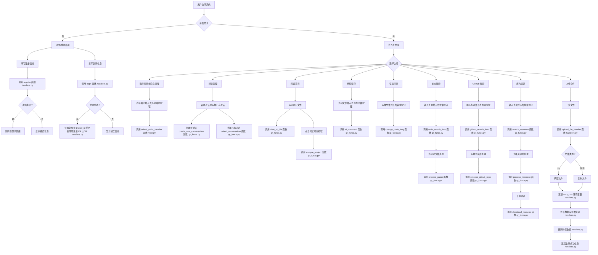

```mermaid

graph TD
    A[用户访问系统] --> B{是否登录}
    B -- 是 --> C[进入主界面]
    B -- 否 --> D[注册/登录界面]

    D --> E[填写注册信息]
    E --> F[调用 register 函数 handlers.py]
    F --> G{注册成功？}
    G -- 是 --> H[跳转到登录界面]
    G -- 否 --> I[显示错误信息]

    D --> J[填写登录信息]
    J --> K[调用 login 函数 handlers.py]
    K --> L{登录成功？}
    L -- 是 --> M[设置全局变量 user_id 并更新环境变量 PRJ_DIR handlers.py]
    L -- 否 --> N[显示错误信息]

    C --> O{选择功能}
    O --> P[选择项目或论文路径]
    O --> Q[对话管理]
    O --> R[阅读项目]
    O --> S[代码注释]
    O --> T[语言转换]
    O --> U[论文搜索]
    O --> V[GitHub 搜索]
    O --> W[库内资源]
    O --> X[上传文件]

    P --> Y[选择路径并点击选择路径按钮]
    Y --> Z[调用 select_paths_handler 函数 main.py]

    Q --> AA[新建对话或选择已有对话]
    AA --> AB[创建新对话 create_new_conversation 函数, gr_funcs.py]
    AA --> AC[选择已有对话 select_conversation 函数, gr_funcs.py]

    R --> AD[选择项目文件]
    AD --> AE[调用 view_prj_file 函数 gr_funcs.py]
    AD --> AF[点击阅读项目按钮]
    AF --> AG[调用 analyse_project 函数 gr_funcs.py]

    S --> AH[选择文件并点击添加注释按钮]
    AH --> AI[调用 ai_comment 函数 gr_funcs.py]

    T --> AJ[选择文件并点击转换按钮]
    AJ --> AK[调用 change_code_lang 函数 gr_funcs.py]

    U --> AL[输入查询并点击搜索按钮]
    AL --> AM[调用 arxiv_search_func 函数 gr_funcs.py]
    AM --> AN[选择论文并处理]
    AN --> AO[调用 process_paper 函数 gr_funcs.py]

    V --> AP[输入查询并点击搜索按钮]
    AP --> AQ[调用 github_search_func 函数 gr_funcs.py]
    AQ --> AR[选择仓库并处理]
    AR --> AS[调用 process_github_repo 函数 gr_funcs.py]

    W --> AT[输入查询并点击搜索按钮]
    AT --> AU[调用 search_resource 函数 gr_funcs.py]
    AU --> AV[选择资源并处理]
    AV --> AW[调用 process_resource 函数 gr_funcs.py]
    AW --> AX[下载资源]
    AX --> AY[调用 download_resource 函数 gr_funcs.py]

    X --> AZ[上传文件]
    AZ --> BA[调用 upload_file_handler 函数 handlers.py]
    BA --> BB{文件类型？}
    BB -- .zip --> BC[解压文件]
    BB -- 其他 --> BD[复制文件]
    BC --> BE[更新 PRJ_DIR 环境变量 handlers.py]
    BD --> BE
    BE --> BF[更新数据库新增资源 handlers.py]
    BF --> BG[更新前端数据 handlers.py]
    BG --> BH[返回上传成功信息 handlers.py]

```
