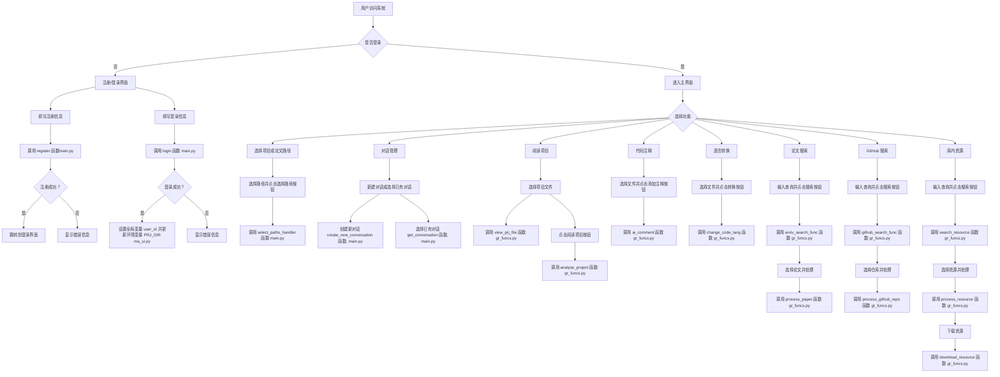

```mermaid
graph TD
    A[用户访问系统] --> B{是否登录}
    B -- 是 --> C[进入主界面]
    B -- 否 --> D[注册/登录界面]

    D --> E[填写注册信息]
    E --> F[调用 register 函数main.py]
    F --> G{注册成功？}
    G -- 是 --> H[跳转到登录界面]
    G -- 否 --> I[显示错误信息]

    D --> J[填写登录信息]
    J --> K[调用 login 函数 main.py]
    K --> L{登录成功？}
    L -- 是 --> M[设置全局变量 user_id 并更新环境变量 PRJ_DIR ma_ui.py]
    L -- 否 --> N[显示错误信息]

    C --> O{选择功能}
    O --> P[选择项目或论文路径]
    O --> Q[对话管理]
    O --> R[阅读项目]
    O --> S[代码注释]
    O --> T[语言转换]
    O --> U[论文搜索]
    O --> V[GitHub 搜索]
    O --> W[库内资源]

    P --> X[选择路径并点击选择路径按钮]
    X --> Y[调用 select_paths_handler 函数 main.py]

    Q --> Z[新建对话或选择已有对话]
    Z --> AA[创建新对话 create_new_conversation 函数, main.py]
    Z --> AB[选择已有对话 get_conversation 函数, main.py]

    R --> AC[选择项目文件]
    AC --> AD[调用 view_prj_file 函数 gr_funcs.py]
    AC --> AE[点击阅读项目按钮]
    AE --> AF[调用 analyse_project 函数 gr_funcs.py]

    S --> AG[选择文件并点击添加注释按钮]
    AG --> AH[调用 ai_comment 函数 gr_funcs.py]

    T --> AI[选择文件并点击转换按钮]
    AI --> AJ[调用 change_code_lang 函数 gr_funcs.py]

    U --> AK[输入查询并点击搜索按钮]
    AK --> AL[调用 arxiv_search_func 函数 gr_funcs.py]
    AL --> AM[选择论文并处理]
    AM --> AN[调用 process_paper 函数 gr_funcs.py]

    V --> AO[输入查询并点击搜索按钮]
    AO --> AP[调用 github_search_func 函数 gr_funcs.py]
    AP --> AQ[选择仓库并处理]
    AQ --> AR[调用 process_github_repo 函数 gr_funcs.py]

    W --> AS[输入查询并点击搜索按钮]
    AS --> AT[调用 search_resource 函数 gr_funcs.py]
    AT --> AU[选择资源并处理]
    AU --> AV[调用 process_resource 函数 gr_funcs.py]
    AV --> AW[下载资源]
    AW --> AX[调用 download_resource 函数 gr_funcs.py]
```
